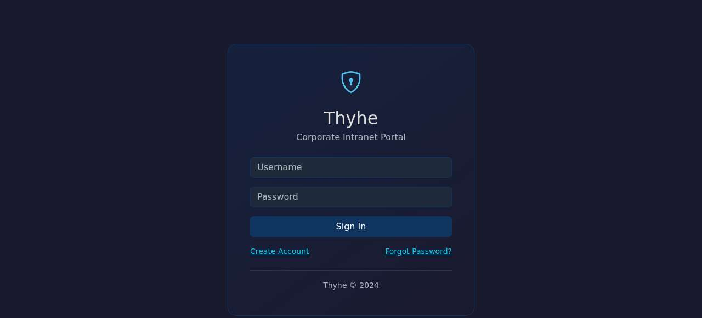
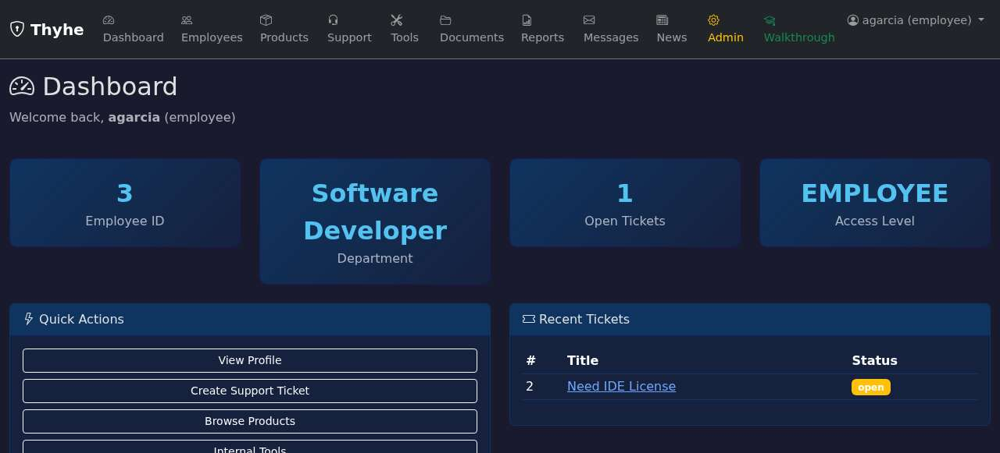
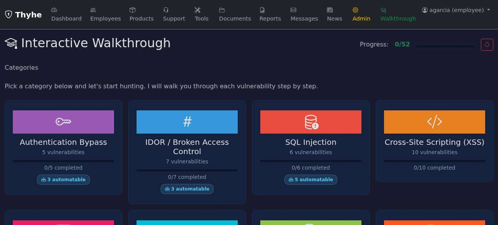
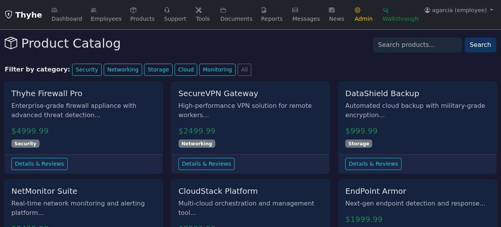
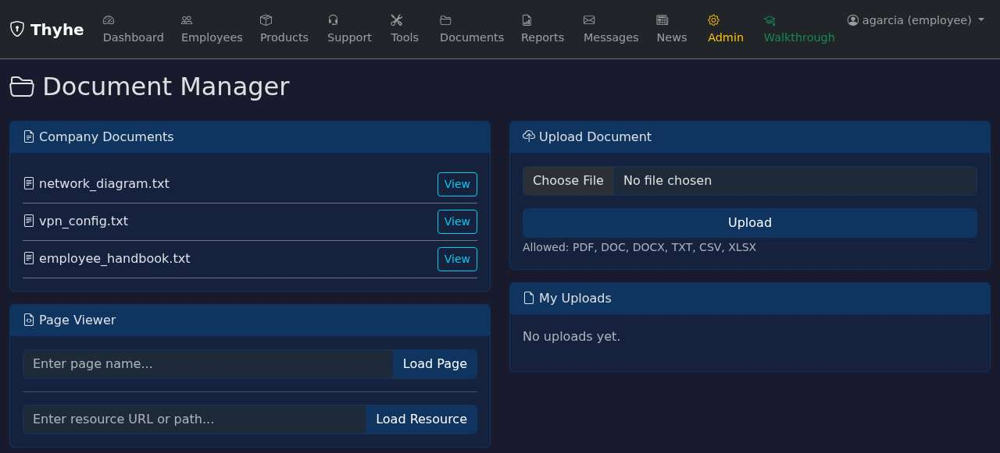
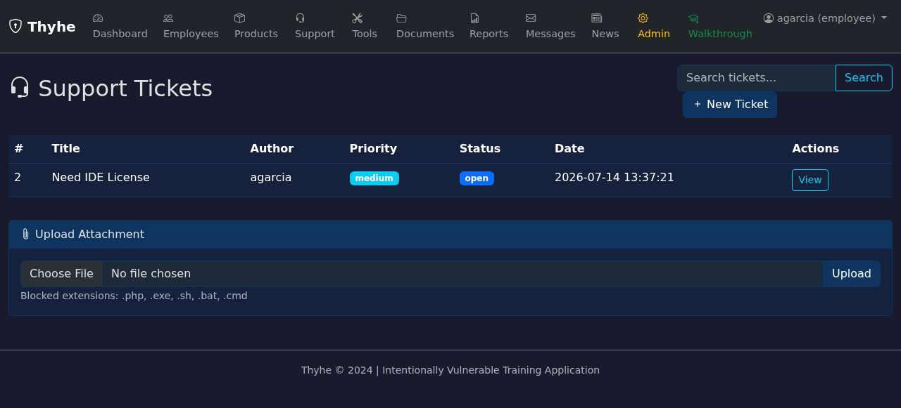

# Thyhe - Deliberately Vulnerable Corporate Web Application

---

**WARNING: This application is intentionally vulnerable. It contains real, exploitable security flaws by design. DO NOT deploy this to any internet-facing server, production environment, or shared network. Run it ONLY on localhost or within an isolated, trusted lab environment. You are solely responsible for any misuse. This software is provided strictly for educational and authorized security training purposes.**

---

Thyhe is a simulated corporate intranet built for learning web application security and bug bounty hunting. It provides a realistic environment with 52 intentional vulnerabilities across 12 categories, covering the most common classes of web application flaws. The app includes an interactive walkthrough that teaches pentesting methodology step-by-step with full solutions for self-paced learning.

## Features

- **Employee Directory** - searchable employee records with profile pages
- **Support Tickets** - create and view support tickets
- **Messaging** - internal messaging system between users
- **News** - company news feed with comments
- **Product Catalog** - product listings with search and reviews
- **Admin Panel** - user management and administrative functions
- **Network Tools** - ping, DNS lookup, traceroute, URL checker, webhook tester, price comparison
- **Reports** - report generation and XML import
- **File Uploads** - document upload and viewer
- **Interactive Walkthrough** (`/walkthrough`) - guided pentesting tutorial with a mentor-style approach that teaches methodology step-by-step, including full solutions for each vulnerability
- **Clean State** - the SQLite database is recreated on each restart, so you always start fresh

## Screenshots

### Login
Clean dark-themed login page. The first barrier - but SQL injection on the login form, username enumeration, and MFA bypass all live here.



### Dashboard
The main hub after authentication. Quick stats, recent activity, and navigation to every module in the app.



### Interactive Walkthrough
Step-by-step pentesting tutorial built into the app. Covers all 12 vulnerability categories with hints, methodology, and full solutions.



### Product Catalog
Product listings with search and category filters. Multiple SQL injection vectors (UNION-based and blind boolean-based) and stored XSS in reviews.



### Document Manager
File uploads, a document viewer, and a page loader. Attack surface includes LFI, RFI, unrestricted file upload, and MIME type bypass.



### Support Tickets
Ticket system with search and file attachments. Targets include SQLi on search, stored XSS in ticket content, IDOR on ticket IDs, and extension blocklist bypass on uploads.



## Tech Stack

- **Backend:** Python / Flask (single file - `app.py`)
- **Database:** SQLite (auto-created on first run)
- **Templating:** Jinja2
- **Frontend:** Bootstrap 5 (dark theme)
- **Auth:** Session-based + JWT for API endpoints

## Requirements

- Python 3.8+
- pip packages listed in `requirements.txt`:
  - flask
  - pyjwt
  - requests
  - werkzeug
  - jinja2
  - markupsafe
  - lxml

No external services or databases are required. Everything runs locally.

## Installation

```bash
git clone <repo-url>
cd thyhe
pip install -r requirements.txt
python3 app.py
```

The database is automatically created on first run. Open your browser and visit:

```
http://localhost:5000
```

## Default Accounts

| Username | Password       | Notes    |
|----------|----------------|----------|
| admin    | admin123       | Has MFA  |
| jsmith   | password123    | Has MFA  |
| agarcia  | Welcome1!      |          |
| bwilson  | letmein        |          |
| cjones   | qwerty         |          |
| dlee     | dragon         |          |

## Vulnerabilities (52 total, 12 categories)

### 1. Authentication Bypass (5)

- SQL injection on login form
- Username enumeration via error messages
- MFA bypass by swapping username after initial auth
- MFA brute force - no rate limiting on code attempts
- Predictable password reset tokens

### 2. IDOR / Broken Access Control (7)

- Direct access to other users' employee records
- Direct access to other users' support tickets
- Direct access to other users' private messages
- Viewing other users' profiles by ID
- Editing other users' profiles by ID
- Admin panel accessible without admin role
- Open redirect on login/redirect parameter

### 3. SQL Injection (6)

- UNION-based SQLi on product search
- UNION-based SQLi on employee search
- UNION-based SQLi on ticket search
- Blind boolean-based SQLi on product filter
- Second-order SQL injection
- Blind SQLi on API endpoint

### 4. Cross-Site Scripting - XSS (10)

- Reflected XSS on search page
- Reflected XSS on news tags
- Reflected XSS on error page
- Stored XSS in profile bio
- Stored XSS in product reviews
- Stored XSS in support tickets
- Stored XSS in messages
- Stored XSS in news comments
- DOM-based XSS via URL hash fragment
- DOM-based XSS via URL parameters

### 5. Command Injection (3)

- Basic command injection on ping tool
- Filtered command injection on DNS lookup (semicolon blocked, but pipe works)
- Blind command injection on traceroute (via Popen)

### 6. Server-Side Template Injection - SSTI (3)

- SSTI on greeting page (render_template_string)
- SSTI on report generator (render_template_string)
- SSTI on email preview (render_template_string)

### 7. XML External Entity - XXE (3)

- XXE via report import paste
- XXE via XML file upload
- XXE via API XML endpoint

### 8. File Inclusion - LFI/RFI (3)

- Basic Local File Inclusion on document viewer
- LFI with filter bypass using `..././` to evade `../` stripping
- Remote File Inclusion

### 9. Insecure File Upload (3)

- No server-side file validation
- MIME type check bypass
- Extension blocklist bypass

### 10. Cross-Site Request Forgery - CSRF (3)

- No CSRF token on profile edit
- No CSRF token on ticket creation
- Weak CSRF token validation on settings

### 11. Server-Side Request Forgery - SSRF (3)

- Full SSRF on URL checker tool
- Blind SSRF on webhook tester
- Full SSRF on price comparison tool

### 12. JWT Attacks (3)

- Weak JWT signing secret (`secret`)
- Algorithm "none" accepted
- Broken Object Level Authorization via forged JWT

## Project Structure

```
thyhe/
  app.py              # Main application (single file)
  requirements.txt    # Python dependencies
  thyhe.db         # SQLite database (auto-created)
  templates/          # Jinja2 HTML templates
  static/             # CSS and JavaScript
  documents/          # Document files for the viewer
  uploads/            # User-uploaded files
```

## Usage Tips

- Start with the **interactive walkthrough** at `/walkthrough` if you are new to web app pentesting. It guides you through each vulnerability category with hints, methodology, and full solutions.
- All vulnerabilities are marked with comments in the source code (`app.py`) for reference.
- The database resets to its default state every time you restart the app, so feel free to break things.
- Use browser developer tools (Network tab, Console) alongside tools like Burp Suite or OWASP ZAP for a more thorough experience.

## Disclaimer

This application is provided "as is" for educational purposes only. It is designed to be broken into. Never expose it to untrusted networks. Never use it against systems you do not own or have explicit authorization to test. The authors are not responsible for any damage or misuse. Use responsibly and legally.
